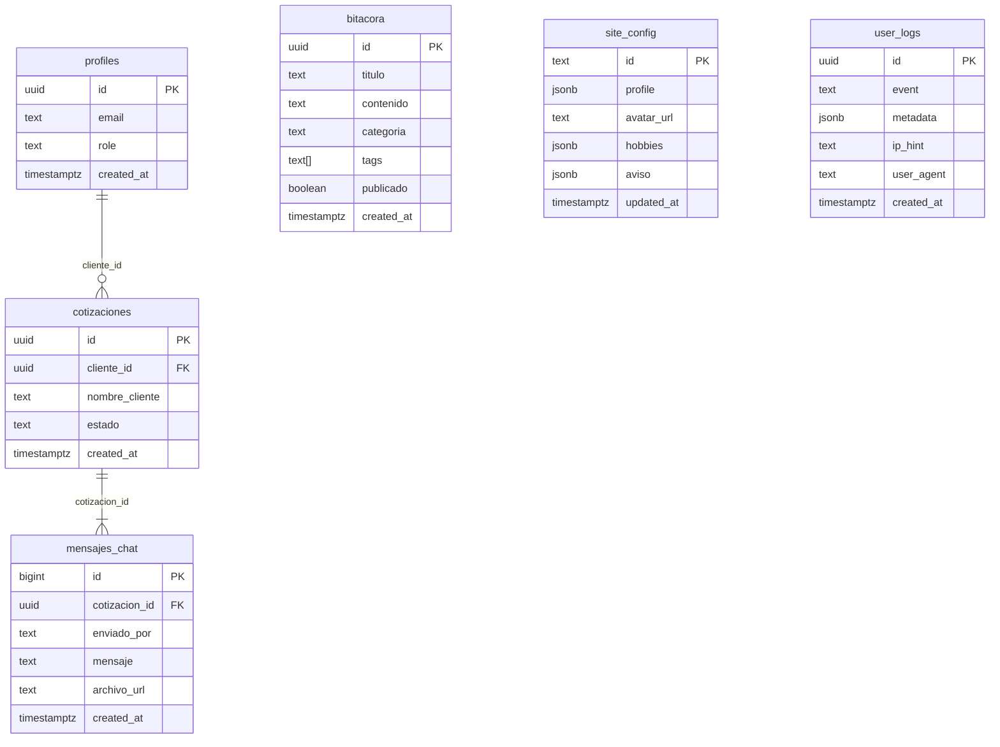
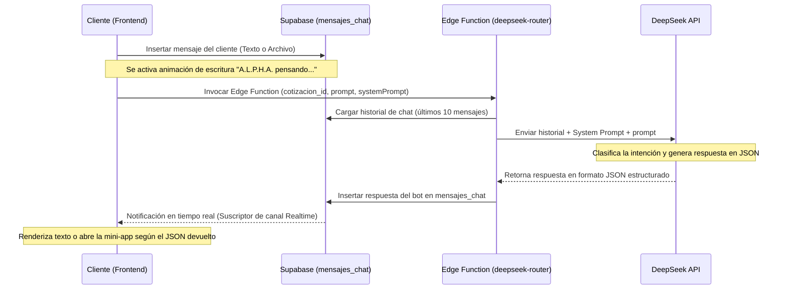

# 🌌 Reporte de Arquitectura y Estructura — Space (Bitácora Personal)

Este documento detalla la arquitectura técnica, la estructura del código, el modelo de datos y el funcionamiento del ecosistema **Space**, la bitácora personal, portafolio y suite de servicios digitales de **Pablo DP** (Samuel Y. Pablo Claudio).

---

## 🔍 1. Resumen Ejecutivo
**Space** es una plataforma web reactiva y táctica que actúa como:
1. **Portafolio y Ficha Curricular**: Exposición de proyectos, habilidades y servicios digitales brindados por el propietario.
2. **Bitácora Personal (Blog)**: Publicaciones administrables sobre tecnología, desarrollo y apuntes.
3. **Centro Operativo de Asistencia (A.L.P.H.A.)**: Un chat inteligente en tiempo real asistido por IA (**DeepSeek V3**) para atención a clientes, cotizaciones y ejecución de mini-aplicaciones dinámicas en el frontend.
4. **Mini-Aplicaciones Tácticas**: Herramientas utilitarias complejas incrustadas (Generador de QR, Resolutor Matemático y Creador de Trípticos).

---

## 🛠️ 2. Stack Tecnológico
La aplicación se compone de un frontend desacoplado y un backend serverless:

* **Frontend**:
  * **React 19** & **Vite 8**: Para el renderizado rápido de interfaces reactivas y empaquetado optimizado.
  * **Tailwind CSS 4**: Utilizado para estilos modulares, optimizando el rendimiento visual mediante variables nativas CSS y un diseño oscuro táctico (*glassmorphism*).
  * **React Router Dom 6**: Enrutamiento del lado del cliente.
  * **KaTeX**: Para el renderizado ultra-rápido de notación matemática rigurosa.
  * **html-to-image & jsPDF**: Módulos para renderizar vistas HTML en canvas y exportar archivos PDF locales.
  * **Lucide Icons**: Set de iconos vectoriales limpios.

* **Backend & Base de Datos**:
  * **Supabase (PostgreSQL + Auth + Realtime + Storage)**: Motor de persistencia, autenticación de usuarios anónimos/administradores, sincronización de chat y almacenamiento de archivos de cotizaciones.
  * **Supabase Edge Functions**: Entorno Deno seguro para actuar como proxy hacia el modelo de inteligencia artificial DeepSeek-V3, ocultando las credenciales de API.

* **Inteligencia Artificial (IA)**:
  * **DeepSeek V3 (`deepseek-chat`)**: Modelo de lenguaje que opera bajo instrucciones estrictas de formato JSON y clasificación de intenciones en tiempo real.

---

## 📂 3. Estructura de Directorios del Proyecto

La organización del código fuente en el frontend y backend se estructura de la siguiente manera:

```
mibitacora/
├── public/                 # Recursos públicos (favicon, manifiesto PWA, robots, sitemap)
├── src/
│   ├── components/         # Componentes generales de la interfaz
│   │   ├── admin/          # Componentes del CMS administrativo
│   │   ├── home/           # Bloques de la página principal (Hero, Expediente, etc.)
│   │   ├── layouts/        # Diseños estructurados generales (MainLayout)
│   │   ├── miniapps/       # Componentes incrustables en el chat de A.L.P.H.A.
│   │   ├── triptico/       # Canvas, inspectores y paneles del creador de trípticos
│   │   ├── AdminRoute.jsx  # Guardia de rutas protegidas
│   │   ├── Bitacora.jsx    # Visor público de entradas de blog
│   │   ├── SpaceCopilot.jsx# Componente principal de la interfaz del Asistente Virtual
│   │   └── ...             # Componentes de UI comunes (Header, Footer, Loader, etc.)
│   ├── config/             # Configuración y cliente de Supabase
│   ├── context/            # Contextos de React (ej. AuthContext para sesión)
│   ├── data/               # Configuraciones estáticas y datos base (siteData.js)
│   ├── hooks/              # Hooks personalizados (useCopilotChat, useTripticoState)
│   ├── lib/                # Utilidades de animación y configuración del sitio
│   ├── pages/              # Páginas ruteadas (Home, Login, Admin, Mini-apps)
│   ├── utils/              # Lógica de cálculo matemático (mathSolver.js)
│   ├── App.jsx             # Declaración de rutas y estructura principal
│   ├── index.css           # Estilos globales y variables Tailwind CSS 4
│   └── main.jsx            # Punto de entrada de React
├── supabase/
│   ├── functions/          # Lógica serverless (Edge Function: deepseek-router)
│   └── migrations/         # Esquema de base de datos relacional
```

---

## 🗄️ 4. Modelo de Datos y Base de Datos (Supabase)

El backend de base de datos PostgreSQL se divide en tres áreas principales gestionadas mediante migraciones estructuradas en [supabase/migrations](file:///E:/OneDrive/mibitacora/supabase/migrations):

### 💾 Esquema de Tablas



1. **`public.profiles`**: Enlaza usuarios de `auth.users` con roles específicos de la aplicación (`user`, `admin`, `superadmin`). Se crea un perfil por defecto mediante un trigger de base de datos cuando se registra un usuario.
2. **`public.site_config`**: Tabla singleton (con `id = 'main'`) que guarda la información dinámica expuesta en el portafolio (bio, enlaces, avatar, hobbies y banners informativos). Se edita en tiempo real desde el panel de administración.
3. **`public.bitacora`**: Almacena las publicaciones del blog personal, incluyendo contenido en Markdown, categoría (`general`, `dev`, `personal`, `proyecto`), etiquetas y estado de publicación (`publicado = true/false`).
4. **`public.user_logs`**: Tabla de eventos de análisis interno para monitorear el uso de las mini-apps, visitas y acciones del sistema.
5. **`public.cotizaciones`**: Registra los tickets de soporte o presupuestos. Cada cotización pertenece a un usuario (incluyendo anónimos) y posee un estado (`pendiente`, `en_progreso`, `finalizado`).
6. **`public.mensajes_chat`**: Los mensajes en tiempo real dentro de cada cotización. Se habilitó **Supabase Realtime** en esta tabla para permitir mensajería bidireccional inmediata.

### 🛡️ Políticas de Seguridad (Row Level Security - RLS)
* **Bitácora**: Cualquier visitante puede leer entradas (`publicado = true`). Modificar o crear publicaciones está restringido a usuarios con rol `admin` o `superadmin`.
* **Configuración del Sitio**: Modificable únicamente por el `superadmin`.
* **Mensajería & Cotizaciones**: Los usuarios normales solo pueden leer e insertar registros que tengan su propio `cliente_id` (`auth.uid() = cliente_id`). Los administradores tienen acceso global para auditar y responder.
* **Storage de Documentos**: Se cuenta con el bucket `documentos-cotizaciones` estructurado para que los clientes suban documentos únicamente a la subcarpeta asociada a su ID de usuario (`auth.uid()`), protegiendo la privacidad de los documentos enviados.

---

## 🤖 5. Protocolo Alpha & Asistente A.L.P.H.A.

El asistente virtual **A.L.P.H.A.** opera como un sistema inteligente reactivo dentro del chat de cotizaciones. Está alojado en el componente [SpaceCopilot.jsx](file:///E:/OneDrive/mibitacora/src/components/SpaceCopilot.jsx) y su cerebro lógico reside en la Edge Function [deepseek-router/index.ts](file:///E:/OneDrive/mibitacora/supabase/functions/deepseek-router/index.ts).

### 🔄 Flujo de Mensajería e Invocación de Mini-Apps



### 🧠 Formato de Respuestas de la IA
El modelo de IA está programado para responder estrictamente bajo un esquema JSON:
```json
{
  "intent": "HERRAMIENTA_AUTOMATIZADA" | "SERVICIO_MANUAL" | "SYSTEM_MEMORY",
  "tool_name": "qr_generator" | "math_solver" | "triptico_maker" | "save_note" | null,
  "action": "OPEN_MINI_APP" | "COLLECT_INFO" | "NORMAL_CHAT" | "EXECUTE_TOOL",
  "message": "Respuesta textual de confirmación.",
  "ui_state": { 
    "show_uploader": true, 
    "note_content": "Notas a guardar en base de datos si aplica", 
    "panel_active": "qr_config_panel" | null 
  }
}
```
Si el frontend detecta `tool_name` no nulo en el mensaje, **renderiza de manera incrustada en la burbuja del chat la mini-app correspondiente** (por ejemplo, el generador de QR con parámetros pre-configurados por el bot).

---

## 📱 6. Mini-Aplicaciones Integradas

### 🎯 A. Generador de Códigos QR (`/qr`)
* **Ubicación**: [QRGeneratorPage.jsx](file:///E:/OneDrive/mibitacora/src/pages/QRGeneratorPage.jsx) / [QRGeneratorApp.jsx](file:///E:/OneDrive/mibitacora/src/components/miniapps/QRGeneratorApp.jsx)
* **Funciones**: Permite crear códigos QR personalizando el color de fondo, color de los módulos, margen, tamaño, y el texto o enlace contenedor. Incorpora descarga en PNG y vistas responsivas.

### 🧮 B. Apuntes Matemáticos Pro (`/math`)
* **Ubicación**: [MathSolverPage.jsx](file:///E:/OneDrive/mibitacora/src/pages/MathSolverPage.jsx) / [MathSolverApp.jsx](file:///E:/OneDrive/mibitacora/src/components/miniapps/MathSolverApp.jsx)
* **Funciones**: Solucionador algebraico paso a paso para ecuaciones polinómicas de grados 2, 3 y 4. Aplica métodos rigurosos de completado de cuadrados, fórmulas de Cardano para cúbicas y el método de Ferrari para cuárticas. Renders matemáticos dinámicos con `katex`.

### 🎨 C. Tríptico Maker (`/tripticos`)
* **Ubicación**: [TripticoMakerPage.jsx](file:///E:/OneDrive/mibitacora/src/pages/TripticoMakerPage.jsx) / [TripticoMakerApp.jsx](file:///E:/OneDrive/mibitacora/src/components/miniapps/TripticoMakerApp.jsx)
* **Funciones**:
  * Diseñador interactivo A4 de trípticos en formato apaisado (exterior e interior).
  * Soporte de división en columnas dinámicas y bloques de texto o encabezados personalizables.
  * **Generador por IA**: Permite enviar un tema a la IA, la cual responde con una estructura JSON detallada cargando automáticamente textos profesionales en las 6 caras del tríptico.
  * **Exportación**: Generación de PDF multi-página del tríptico finalizado usando `html-to-image` y `jsPDF`.

---

## 🔒 7. Panel de Administración (`/admin`)

El panel de control protegido mediante el middleware [AdminRoute.jsx](file:///E:/OneDrive/mibitacora/src/components/AdminRoute.jsx) expone las siguientes pestañas de gestión para el administrador:

1. **Gestión del Portafolio (CMS)**: Edición directa del JSON de perfil en la base de datos (nombre, puesto, biografía, enlaces, banners dinámicos y avatar).
2. **Entradas de Bitácora**: CRUD completo para redactar y editar artículos en Markdown, con opción de previsualización en vivo e interruptor de publicación.
3. **Centro de Mensajería**: Interfaz administrativa que lista todas las cotizaciones abiertas. Permite abrir chats en tiempo real con clientes individuales para dar soporte, presupuestar de forma manual y auditar archivos subidos.
4. **Consola de Actividad**: Vista paginada de `user_logs` recopilados para analizar el tráfico del sitio y el uso de las mini-apps.

---

## 🚀 8. Instrucciones de Configuración y Despliegue Local

### Variables de Entorno (`.env`)
El proyecto requiere un archivo `.env` en la raíz con las siguientes claves:
```env
VITE_SUPABASE_URL=https://<tu-proyecto>.supabase.co
VITE_SUPABASE_ANON_KEY=<tu-anon-key>
```

Para las Edge Functions de Supabase, se configuran las variables internas del CLI de Supabase:
```bash
supabase secrets set DEEPSEEK_API_KEY="tu-api-key-de-deepseek"
supabase secrets set SUPABASE_SERVICE_ROLE_KEY="tu-service-role-key"
```

### Comandos de Ejecución
1. Instalar dependencias:
   ```bash
   npm install
   ```
2. Ejecutar entorno de desarrollo local:
   ```bash
   npm run dev
   ```
3. Construir paquete de producción:
   ```bash
   npm run build
   ```

---
*Reporte generado automáticamente para la bitácora de Pablo DP. Última actualización: Junio de 2026.*
